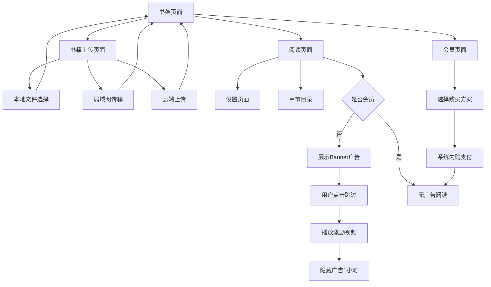

## 1. Product Overview
简化版"微信读书"APP是一款专注于TXT电子书阅读的跨平台移动应用。通过本地语音朗读、智能章节识别和个性化阅读设置，为用户提供便捷的移动阅读体验。主要解决用户在移动设备上阅读TXT格式电子书的需求，特别适合喜欢听书和自定义阅读体验的用户群体。

目标市场：移动阅读爱好者、有声书用户、学生群体。

## 2. Core Features

### 2.1 User Roles
本产品分为免费用户和会员用户：
- **免费用户**：可使用所有基础阅读功能，底部展示Banner广告。
- **会员用户**：无广告，享有会员专属权益。

### 2.2 Feature Module
本阅读APP包含以下核心页面：
1. **书架页面**：显示已上传书籍列表、书籍管理、上传入口。
2. **阅读页面**：文本显示、语音朗读控制、阅读设置、章节导航。
3. **书籍上传页面**：本地文件选择、局域网传输、云端上传选项。
4. **设置页面**：字体大小、主题模式、翻页模式、自动翻页设置。
5. **广告模块**：阅读全屏模式下Banner横幅广告，支持离线缓存、激励视频跳过。
6. **会员模块**：会员购买页面，支持买断制、月订阅、年订阅三种方式。

### 2.3 Page Details
| Page Name | Module Name | Feature description |
|-----------|-------------|---------------------|
| 书架页面 | 书籍列表 | 显示所有已上传书籍，显示书名、阅读进度、最后阅读时间 |
| 书架页面 | 书籍管理 | 删除书籍、重新扫描章节、查看书籍详情 |
| 书架页面 | 上传入口 | 提供本地、局域网、云端三种上传方式的入口按钮 |
| 阅读页面 | 文本显示 | 显示当前章节内容，支持字体大小调整、主题切换 |
| 阅读页面 | 语音朗读 | 调用系统TTS朗读文本，支持语速调节、语音选择、播放/暂停 |
| 阅读页面 | 章节导航 | 显示章节目录，支持点击跳转，显示当前章节位置 |
| 阅读页面 | 阅读设置 | 字体大小滑块、主题切换按钮、翻页模式选择 |
| 阅读页面 | 自动翻页 | 设置自动翻页时间间隔，启动/暂停自动翻页功能 |
| 书籍上传页面 | 本地上传 | 调用系统文件选择器，选择TXT文件并读取内容 |
| 书籍上传页面 | 局域网上传 | 启动HTTP服务接收局域网内其他设备传输的TXT文件 |
| 书籍上传页面 | 云端上传 | 连接Firebase Storage上传和下载TXT文件 |
| 设置页面 | 阅读偏好 | 保存字体大小、主题模式、翻页模式设置 |
| 设置页面 | 语音设置 | 语速调节、语音选择、朗读音量设置 |
| 阅读页面 | 广告横幅 | 全屏模式下底部居中Banner，高度约为TabBar一半，非会员用户可见 |
| 阅读页面 | 激励视频 | 用户点击"跳过"后播放激励视频，完成后隐藏Banner广告1小时 |
| 会员页面 | 购买方案 | 展示买断制、月订阅、年订阅三种方案及价格对比 |
| 会员页面 | 购买流程 | 调用系统内购完成支付，支持恢复购买 |
| 会员页面 | 会员状态 | 显示当前会员类型、到期时间（订阅制）或永久状态（买断制）|

## 3. Core Process
用户首次使用流程：打开APP → 进入书籍上传页面 → 选择上传方式（本地/局域网/云端）→ 选择TXT文件 → 系统自动识别章节 → 进入阅读页面 → 调整阅读设置 → 开始阅读或语音朗读。

日常阅读流程：打开APP → 书架页面选择书籍 → 进入阅读页面 → 继续上次阅读位置 → 可选择语音朗读或手动阅读 → 通过目录跳转章节 → 调整阅读设置 → 退出时自动保存进度。

广告流程（免费用户）：进入阅读全屏模式 → 底部展示Banner广告（循环播放/缓存播放）→ 用户点击"跳过" → 播放激励视频 → 视频结束后隐藏Banner广告1小时。

会员购买流程：进入会员页面 → 选择方案（买断/月订阅/年订阅）→ 调用系统内购弹窗 → 支付成功 → 解锁会员权益（隐藏广告）。

## 4. User Interface Design

### 4.1 Design Style
- 主色调：#1E88E5（深蓝色）
- 辅助色：#FFFFFF（白色）、#424242（深灰色）
- 夜间模式：#121212（深黑）、#FFFFFF（白色文字）
- 按钮样式：圆角矩形，扁平化设计
- 字体：系统默认字体，正文字号16-20sp可调节
- 布局风格：卡片式布局，底部导航栏
- 图标风格：简约线性图标，使用react-native-vector-icons

### 4.2 Page Design Overview
| Page Name | Module Name | UI Elements |
|-----------|-------------|-------------|
| 书架页面 | 书籍列表 | 卡片式书籍封面网格，显示书名和进度条，右上角更多按钮 |
| 阅读页面 | 文本显示 | 全屏阅读模式，顶部状态栏显示章节名，底部控制栏 |
| 阅读页面 | 语音控制 | 底部浮动播放条，包含播放/暂停、语速调节滑块 |
| 书籍上传页面 | 上传选项 | 三个大按钮分别对应三种上传方式，简洁明了 |
| 设置页面 | 设置项 | 分组列表样式，开关按钮、滑块控件、选择器 |

### 4.3 Responsiveness
采用移动端优先设计，完全适配iOS和Android平台。支持横竖屏切换，横屏时自动调整布局为双栏显示（目录+内容）。触摸交互优化，支持滑动手势翻页、双指缩放字体。

### 4.4 3D Scene Guidance
本产品为2D界面，无需3D场景设计。