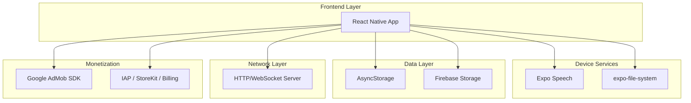
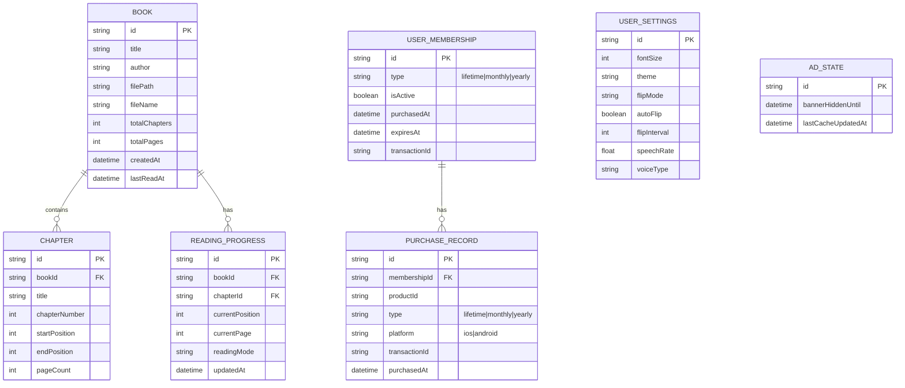

## 1. Architecture design



## 2. Technology Description
- Frontend: React Native@0.72 + Expo@49
- Initialization Tool: expo-cli
- Backend: 无（纯客户端应用）
- 核心依赖：
  - expo-speech: 系统TTS语音朗读
  - expo-file-system: 本地文件系统操作
  - expo-document-picker: 文件选择器
  - @react-native-async-storage/async-storage: 本地数据持久化
  - firebase/storage: 云端存储（可选）
  - react-native-fs: 增强文件操作能力
  - react-native-google-mobile-ads: AdMob广告（Banner + 激励视频），支持广告预加载与本地缓存
  - react-native-iap: iOS App Store / Google Play 内购，支持买断制与订阅制

## 3. Route definitions
| Route | Purpose |
|-------|---------|
| / | 书架页面，显示所有书籍 |
| /reader/:bookId | 阅读页面，显示书籍内容和阅读控制 |
| /upload | 书籍上传页面，提供多种上传方式 |
| /settings | 设置页面，用户偏好设置 |
| /chapters/:bookId | 章节目录页面，显示书籍章节列表 |
| /membership | 会员页面，展示购买方案、会员状态 |

## 4. API definitions
本产品为纯客户端应用，无后端API接口。所有功能通过设备原生API和第三方SDK实现。

## 5. Server architecture diagram
无服务器端架构，所有功能在客户端完成。

## 6. Data model

### 6.1 Data model定义


### 6.2 Data Definition Language
本产品使用AsyncStorage进行数据存储，采用JSON格式存储数据对象。

书籍数据存储结构：
```javascript
// books 数据结构
{
  "books": [
    {
      "id": "book_001",
      "title": "示例小说",
      "author": "未知作者",
      "filePath": "file:///path/to/book.txt",
      "fileName": "book.txt",
      "totalChapters": 20,
      "totalPages": 200,
      "createdAt": "2024-01-01T00:00:00Z",
      "lastReadAt": "2024-01-15T12:30:00Z"
    }
  ]
}

// chapters 数据结构
{
  "chapters_book_001": [
    {
      "id": "chapter_001",
      "bookId": "book_001",
      "title": "第一章 开始",
      "chapterNumber": 1,
      "startPosition": 0,
      "endPosition": 1500,
      "pageCount": 15
    }
  ]
}

// readingProgress 数据结构
{
  "progress_book_001": {
    "id": "progress_001",
    "bookId": "book_001",
    "chapterId": "chapter_001",
    "currentPosition": 750,
    "currentPage": 8,
    "readingMode": "flip",
    "updatedAt": "2024-01-15T12:30:00Z"
  }
}

// userSettings 数据结构
{
  "userSettings": {
    "id": "settings_001",
    "fontSize": 18,
    "theme": "light",
    "flipMode": "horizontal",
    "autoFlip": false,
    "flipInterval": 30,
    "speechRate": 1.0,
    "voiceType": "default"
  }
}

// membership 数据结构
{
  "membership": {
    "id": "membership_001",
    "type": "yearly",          // "lifetime" | "monthly" | "yearly"
    "isActive": true,
    "purchasedAt": "2024-01-01T00:00:00Z",
    "expiresAt": "2025-01-01T00:00:00Z",  // lifetime 时为 null
    "transactionId": "ios_txn_xxxxx"
  }
}

// adState 数据结构
{
  "adState": {
    "id": "ad_state_001",
    "bannerHiddenUntil": "2024-01-15T14:30:00Z",  // 用户跳过后隐藏到此时间
    "lastCacheUpdatedAt": "2024-01-15T10:00:00Z"
  }
}
```

## 7. 目录结构设计
```
src/
├── components/           # 通用组件
│   ├── BookCard/        # 书籍卡片组件
│   ├── ChapterList/     # 章节目录组件
│   ├── ReaderView/      # 阅读视图组件
│   ├── SpeechControl/   # 语音控制组件
│   └── SettingsPanel/   # 设置面板组件
├── screens/             # 页面组件
│   ├── BookshelfScreen.js
│   ├── ReaderScreen.js
│   ├── UploadScreen.js
│   ├── SettingsScreen.js
│   ├── ChaptersScreen.js
│   └── MembershipScreen.js
├── services/            # 业务服务
│   ├── BookService.js   # 书籍管理服务
│   ├── ChapterService.js # 章节解析服务
│   ├── SpeechService.js # 语音朗读服务
│   ├── FileService.js   # 文件处理服务
│   ├── StorageService.js # 数据存储服务
│   ├── AdService.js     # 广告加载、缓存、展示控制
│   └── MembershipService.js # 内购、会员状态管理
├── utils/               # 工具函数
│   ├── chapterParser.js # 章节解析工具
│   ├── fileReader.js    # 文件读取工具
│   ├── constants.js     # 常量定义
│   └── helpers.js       # 通用辅助函数
├── navigation/          # 导航配置
│   └── AppNavigator.js
├── hooks/               # 自定义Hooks
│   ├── useBooks.js      # 书籍数据管理
│   ├── useSettings.js   # 设置管理
│   └── useSpeech.js     # 语音控制
└── App.js              # 应用入口
```

## 8. 核心模块分工
- **BookService**: 负责书籍的CRUD操作，书籍元数据管理
- **ChapterService**: 负责TXT文件的章节解析和分页处理
- **SpeechService**: 封装Expo Speech API，提供语音朗读功能
- **FileService**: 处理文件上传、读取、存储等操作
- **StorageService**: 封装AsyncStorage，提供统一的数据持久化接口
- **ReaderView**: 核心阅读组件，处理文本渲染、翻页动画、手势识别
- **SpeechControl**: 语音播放控制面板，提供播放/暂停、语速调节等功能
- **AdService**: 封装 AdMob SDK，负责 Banner 广告与激励视频的预加载、缓存管理、展示时机控制（含离线缓存播放和1小时隐藏逻辑）
- **MembershipService**: 封装 react-native-iap，处理内购产品查询、支付发起、收据验证、购买恢复，维护本地会员状态

## 9. 广告模块设计说明
- **Banner展示**：仅在阅读全屏模式下，底部居中叠加，高度约为TabBar的50%，非会员用户可见
- **离线缓存策略**：每次联网时预加载并缓存广告素材到本地文件系统；无网络时直接播放最后一次缓存广告
- **激励视频跳过流程**：用户点击跳过 → 加载并播放激励视频 → 播放完毕 → 写入 `adState.bannerHiddenUntil = now + 1h` → Banner隐藏
- **会员免广告**：`MembershipService.isActive()` 返回 true 时，`AdService` 不加载任何广告

## 10. 会员模块设计说明
- **产品 SKU**：
  - `com.mosound.lifetime`：买断制（一次性付款，永久生效）
  - `com.mosound.monthly`：月订阅（自动续订）
  - `com.mosound.yearly`：年订阅（自动续订）
- **本地状态**：购买成功后写入 AsyncStorage `membership`，记录类型、生效时间、到期时间
- **订阅到期检查**：每次 App 启动时调用 `MembershipService.restore()` 与平台收据校验同步状态
- **恢复购买**：会员页面提供"恢复购买"入口，调用 `IAP.restorePurchases()`